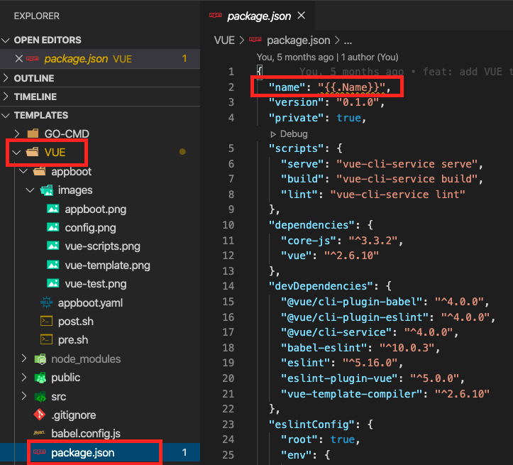
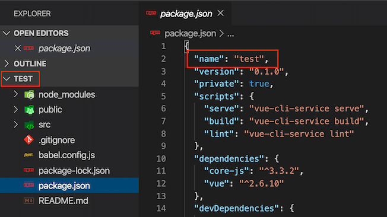

# Templates

> appboot 模板

## 模板

`模板`是 appboot 的一个重要概念。如果你使用过 [Helm](https://helm.sh/docs/intro/), `模板`非常类似 Helm 的 **Chart**。

`模板`使用模板语法，用 `{{.xxx}}` 来为 appbot 的参数占位。

`模板`分为代码和配置项两大部分。

### 代码

需要转换为项目代码的模板代码，如[VUE 模板](./VUE)。

## 配置项

配置项存放在`模板`中的 `appboot` 文件夹，主要用于[appboot](https://github.com/appboot/appboot)前端渲染和后端执行自定义脚本

- `pre.sh`：创建项目之前运行的脚本，如[VUE 模板 pre.sh](./VUE/appboot/pre.sh)
- `post.sh`：创建项目之后运行的脚本，如[VUE 模板 post.sh](./VUE/appboot/post.sh)
- `appboot.yaml`：非脚本配置项，如[VUE 模板 appboot.yaml](./VUE/appboot/appboot.yaml)
  - git：git 的配置项，目前支持 prefix 配置。
  - parameters：参数列表，目前支持 string、int、float 三种类型。

## Demo

下面以[VUE 模板](./VUE)为例，解释模板的使用。

### 代码

通过 [appboot](https://github.com/appboot/appboot) 或者 [appbctl](https://github.com/appboot/appbctl) 创建项目，VUE 模板中 `{{.Name}}` 占位符将被替换为 appboot `Name` 参数。

### 配置项

通过 [appboot](https://github.com/appboot/appboot) 或者 [appbctl](https://github.com/appboot/appbctl) 创建项目，配置项中的 `pre.sh` 和 `post.sh` 将分别在创建项目之前和之后执行。

配置项中的 `appboot.yaml` 会被 [appboot](https://github.com/appboot/appboot) 获取并渲染到前端界面。

