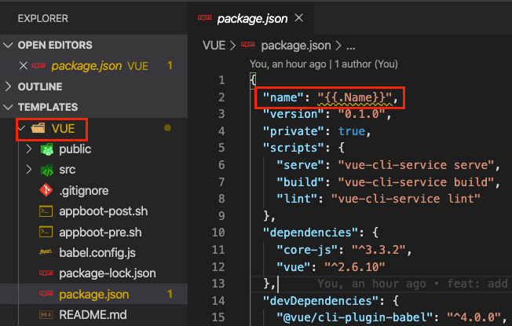
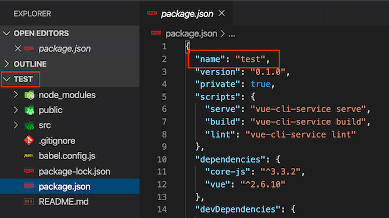
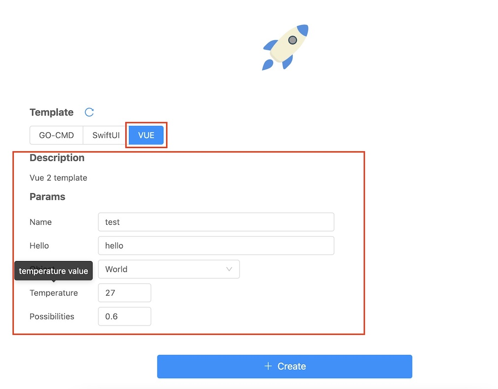

# Templates

[中文](https://github.com/appboot/templates/blob/master/README-CN.md)

> appboot templates.

## Template

`Template` is important concept of `appboot`. If you have used [Helm](https://helm.sh/docs/intro/), the `template` is very similar to Helm's **Chart**.

`Template` use template syntax and use `{{.xxx}}` to place placeholders for appboot parameters.

`Template` is divided into **code** and **configuration** two parts.

### Code

The template code that needs to be converted to project code, such as [VUE template](./VUE).

### Configuration

The configuration is stored in the template's `appboot/appboot.yaml`.

```yaml
# appboot.yaml
desc: Vue 3 + Typescript + Vite template
parameters:
  - key: Hello
    type: string
    tip: hello string
    default: hello vue
  - key: Object
    type: select
    tip: object value
    options:
      - World
      - Vue
      - iOS
  - key: Temperature
    type: int
    tip: temperature value
    default: 27
    min: 0
    max: 35
  - key: Possibilities
    type: float
    tip: possibilities value
    default: 0.6
    min: 0
    max: 1.0
scripts:
  before:
    - echo before vue
  after:
    - cd appboot && sh after.sh
```

The configuration contains the following parts:

- desc: template description
- parameters: parameter list, currently supports `string, int, float, select` four types.
  > The `Name` is the default parameter, indicating the name of the project, not listed in `parameters`.
- scripts: custom scripts
  - before: The set of commands executed before the project is created.**The current directory(pwd) is the location where appboot is executed**.
  - after: The set of commands to execute after the project is created. **The current directory(pwd) is the root directory of the generated project**.


## Template grouping

When there are many templates, the templates can be grouped.

Add `appboot.yaml` to the template repository and specify `groups`, as shown below

```yaml
groups:
  - id: Back-end Templates
    desc: Back-end templates
    templates:
      - id: GO-CMD
        desc: "golang command line tool template"
  - id: Front-end Templates
    desc: Front-end templates
    templates:
      - id: SwiftUI
        desc: "SwiftUI template"
      - id: VUE
        desc: "Vue 3 + Typescript + Vite template"
```

## Demo

The following takes [VUE template](./VUE) as an example to explain the template.

### Code

Create a project using the [appboot](https://github.com/appboot/appboot) command line.

```sh
❯ appboot create
Using config file: /Users/catchzeng/.appboot/config.yaml
✔ VUE
Name: test
Path: ~/Desktop/test
Enter the parameters, if you need to use the default value, just press Enter.
Hello: hello
✔ World
Temperature: 30
Possibilities: 0.3
Parameters: map[Hello:hello Object:World Possibilities:0.3 Temperature:30]
✔ NO
✔ NO
Running script before the app is created
echo before vue
before vue
Creating folders
Creating files
Running script after the app is created
cd appboot && sh after.sh
......
Finish
```

The `{{.Name}}` placeholder in the VUE template will be replaced with the `Name` parameter of appboot, and the same for other parameters.





### Configuration

If you created the project with [appboot web](https://github.com/appboot/appboot/tree/master/web/appboot), the configuration(`appboot/appboot.yaml`) will be rendered to the front end.

```yaml
# appboot.yaml
desc: Vue 3 + Typescript + Vite template
parameters:
  - key: Hello
    type: string
    tip: hello string
    default: hello vue
  - key: Object
    type: select
    tip: object value
    options:
      - World
      - Vue
      - iOS
  - key: Temperature
    type: int
    tip: temperature value
    default: 27
    min: 0
    max: 35
  - key: Possibilities
    type: float
    tip: possibilities value
    default: 0.6
    min: 0
    max: 1.0
scripts:
  before:
    - echo before vue
  after:
    - cd appboot && sh after.sh
```



The scripts (`scripts/before & scripts/after`) will also be executed before and after the project is created.
